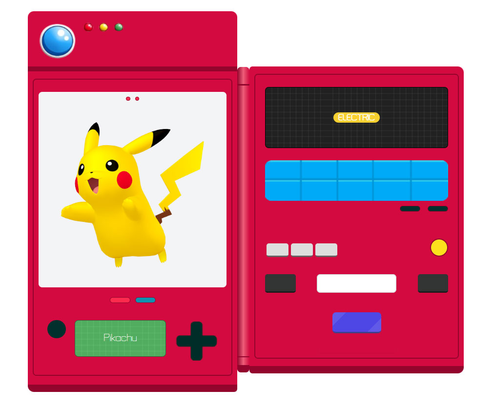
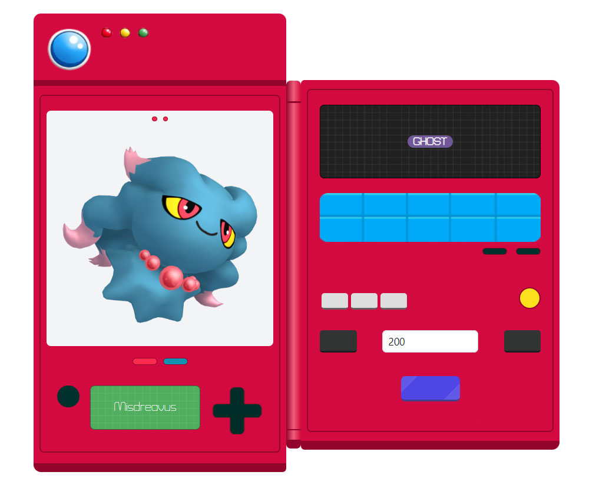
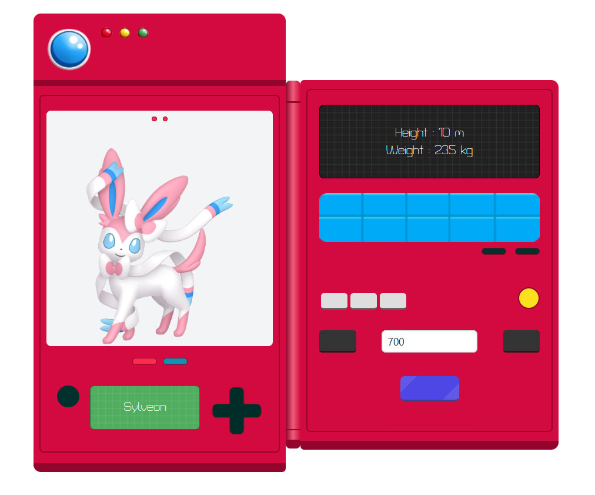
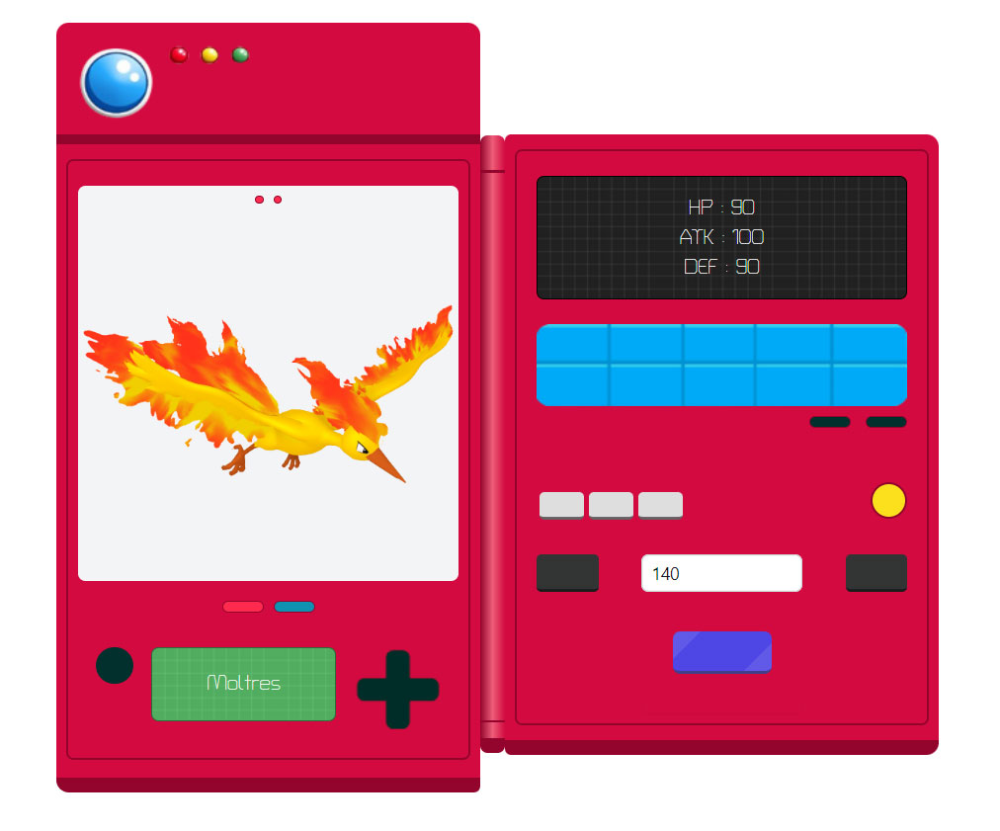

# Pokedex Simulation from pokeAPI
Using React and Tailwind Framework to develop a Pokedex Simulation by pulling data from PokeAPI.

  

# Pokedex screen displayed on web
The main screen shows an image, while the green screen shows the name of the Pokemon.
The black screen shows the element of the Pokemon, with three gray buttons changing the information displayed.

  

 
  
Changing Pokemon in the screen can search or press the black button to next or previou.

  

 

A screen showing the height and weight of Pokemon.

  

 

A screen showing the Pokemon's HP, ATK, and DEF stats.

  

